# How to setup Java and run project from 1st lesson
## Contents
If you already have some of these installed/set-up, you can skip those and jump straight into action.
1. [Install Java](#install-java)
    1. [Windows](#java-for-windows)
    2. [Linux](#java-for-linux)
2. [Install IDE](#install-ide)
    1. [Windows](#idea-for-windows)
    1. [Linux](#idea-for-linux)

## Install Java
First of all you need a Java JDK (stands for Java Development Kit). It includes Java compiler, standard library and JRE (Java Runtime Environment). In short, JDK is a kit for development on Java, JRE is the runtime environment, where Java program is executed.

Personally I'd recommend using JDK version 11. It's a widely supported version. Actually the latest version is 17th, but 11th is the one, 99% of all apps will support. Personally I keep to this version and have no problems with it. This whole guide will be for Java 11.

### Java for Windows
1. Go to the [official website download page](https://www.oracle.com/java/technologies/javase/jdk11-archive-downloads.html) and download version 11.0.11 as `.exe` for Windows 10 x64 (Refer to the screenshot below).

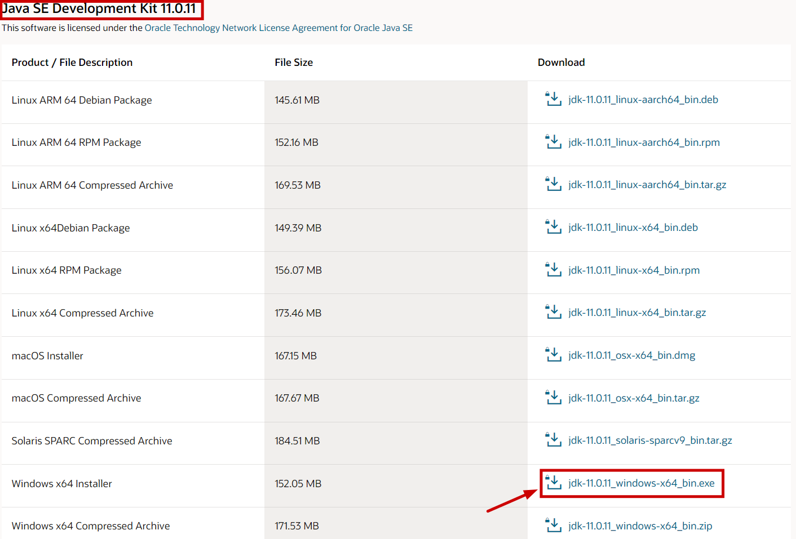

2. Accept agreement.

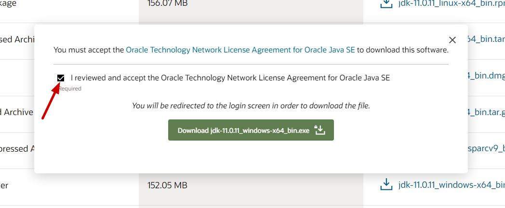

3. Log into your Oracle account or create one, if you don't have it yet.
4. Once you log in, your download should start.
5. Once the download is over, head to the folder you saved the installer to and run it.
6. After running the installer, remember or write down the path where Java will be installed. It will be later reffered to as `java_path`. Other options may be left with default values.

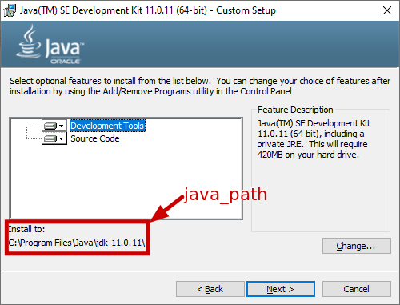

7. Install Java and press `Close` after installation is over.
8. Press `Win + r`.
9. Type in `SystemPropertiesAdvanced` and hit `Enter`.
10. In this window select `Environment Variables...`.

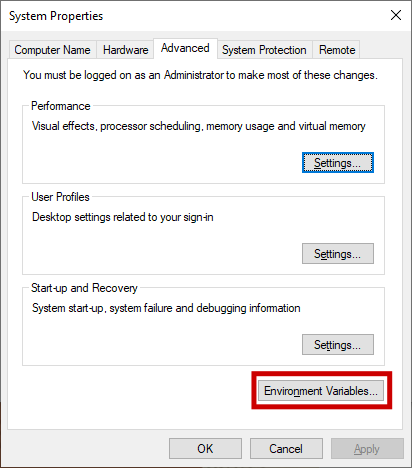

11. In the `User variables for <username>` select `Path` and press `Edit`.

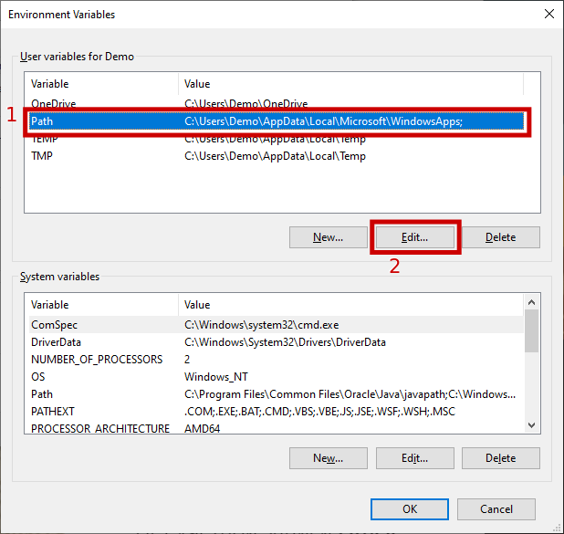

12. Press `New` and type in your `java_path`+`\bin` into the prompt (refer to the screenshot).

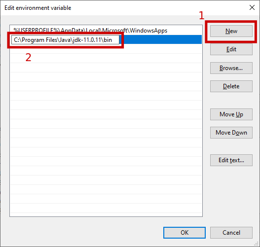

13. Hit `Ok` in all 3 windows to save your changes.
14. Press `Win + r` once again.
15. Type in `cmd` and hit `Enter`.
16. In the newly opened window type `javac --version`. If the output is similar to the screenshot below, you're all set up with Java.

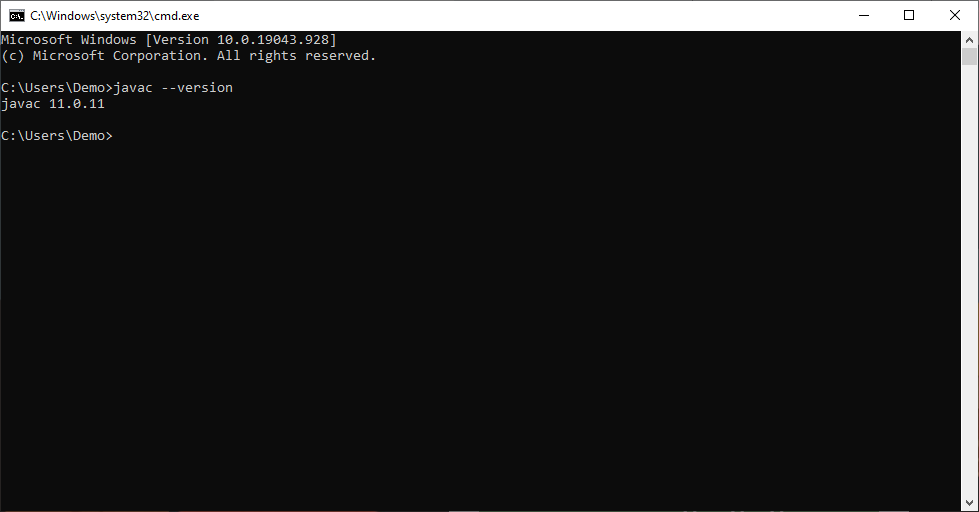

### Java for Linux
When speaking about Linux, I'll suppose you're using Ubuntu or Ubuntu-based distribution, that has `apt` package manager. Otherwise, I guess, you're experienced enough to set-up Java without this guide.

Development life is much easier for Linux users. So, if you use Linux, your setup process is just 3 steps away:
1. Open terminal or terminal emulator.
2. Type in `sudo apt update` to update your packages list.
3. Type in `sudo apt install -y openjdk-11-jdk`.
4. Once the installation is over, in the same terminal type `javac --version`. If the output is similar to the screenshot below, you're all set up with Java.

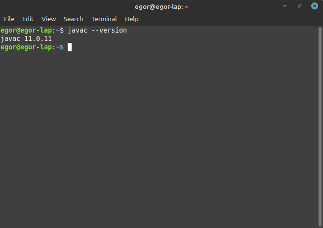

## Install IDE
For the complete newbies, IDE stands for "Integrated Development Environment". It is, basically a set of utils, packed together into a single app, that simplifies programming a lot. It manages launching programs for you, linting code, debugging and all other stuff you may find useful, while developing your app.

I guess, during this course we will all use IntelliJ IDEA. Thus, when I mention "IDE", "IDEA", "IntelliJ" in this guide or somewhere else, it all means the same: IntelliJ IDEA. It may be overfilled with features for a complete beginner, but it is a golden IDE standard for enterprise development. Other possible and popular options are Eclipse, Netbeans and even VSCode with plugins. The latter is not actually an IDE, but a pumped up code editor, but it has most of the features, you'd expect from an IDE. This guide will bedevoted to IDEA only.

### IDEA for Windows
1. Go to the [official download page](https://www.jetbrains.com/idea/download/#section=windows) for the IDEA. and click `Download` under the "Community" edition option. This version is completely free-to-use, though it lacks some enterprise-important features. But for this course they won't be needed.

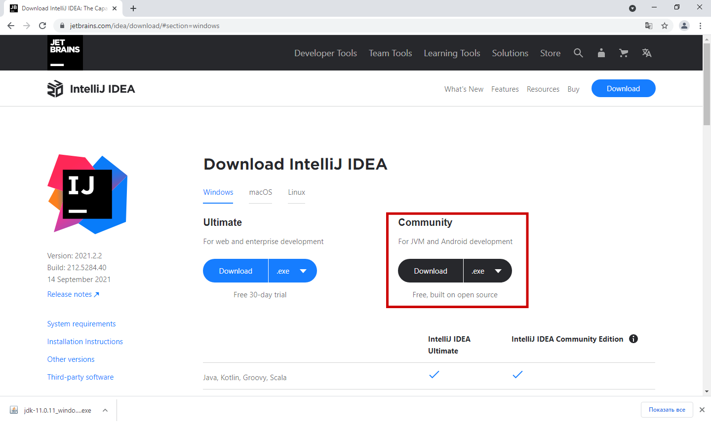

2. Once the download is over, launch the downloaded installer and proceed the installation. You may leave everything unconfigured during the installation, but I prefer to tick options `Create Desktop Shortcut` and `Update Context Menu`. *I strongly **not** recommend you to tick `Update PATH Variable`*. Unless, of course, you know the consequences and understand, why you need this.

3. After installation is over, launch IDEA to check that everything installed correctly. If, after accepting agreement and answering statistics prompt, you see a window, like one on the screenshot below, you have successfully installed your IDE.

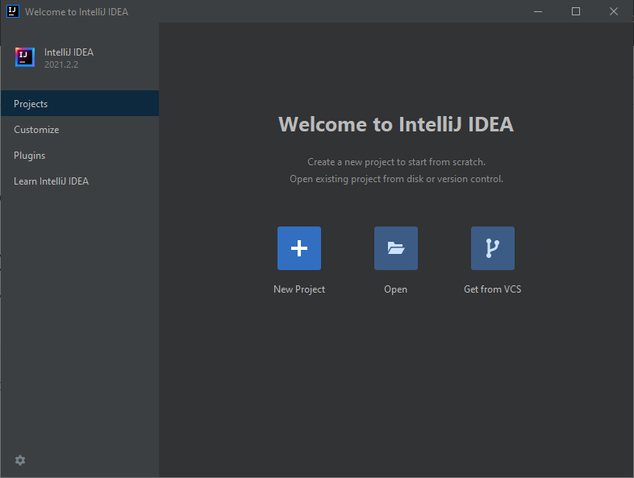

### IDEA for Linux
1. Go to the [official download page](https://www.jetbrains.com/idea/download/#section=windows) for the IDEA. and click `Download` under the "Community" edition option. This version is completely free-to-use, though it lacks some enterprise-important features. But for this course they won't be needed.

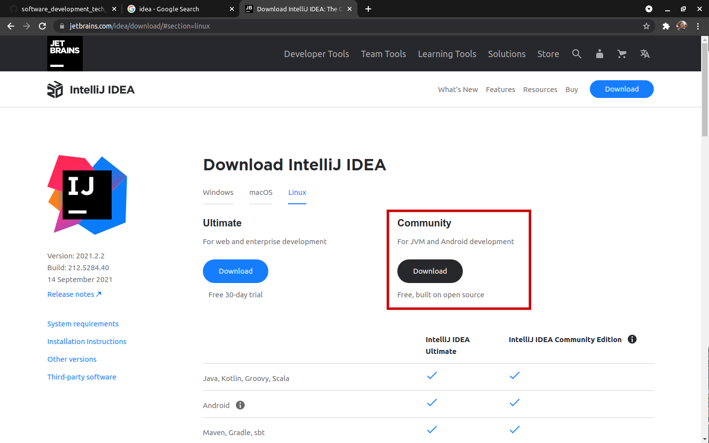

2. Once the download is over, open your terminal, `cd` into the directory, where idea downloaded and run `tar xzf <downloaded file name>`, where `<downloaded file name>` is the name of the `.tar.gz` archive ypu downloaded in 1st step.

3. When this command succeeds, run `sudo mv ./<extracted directory name> /opt/IDEA`, where `<extracted directory name>` is the name of the directory, that got extracted in step 2.

4. Run `/opt/IDEA/bin/idea.sh` to launch the IDE. After accepting agreement and answering statistics prompt, you'll see a window like one on the screenshot, which means everything ok.

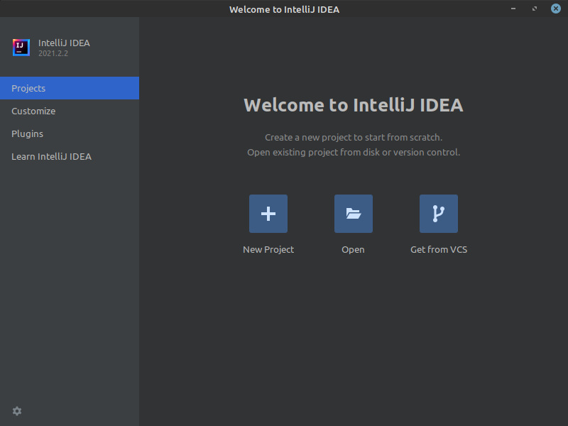

5. [**Optional, but strongly recommended**] Upon the first launch, it's strongly recommended, that you create a desktop entry, so that you don't need to launch idea via terminal each time. Location of this option is shown below.

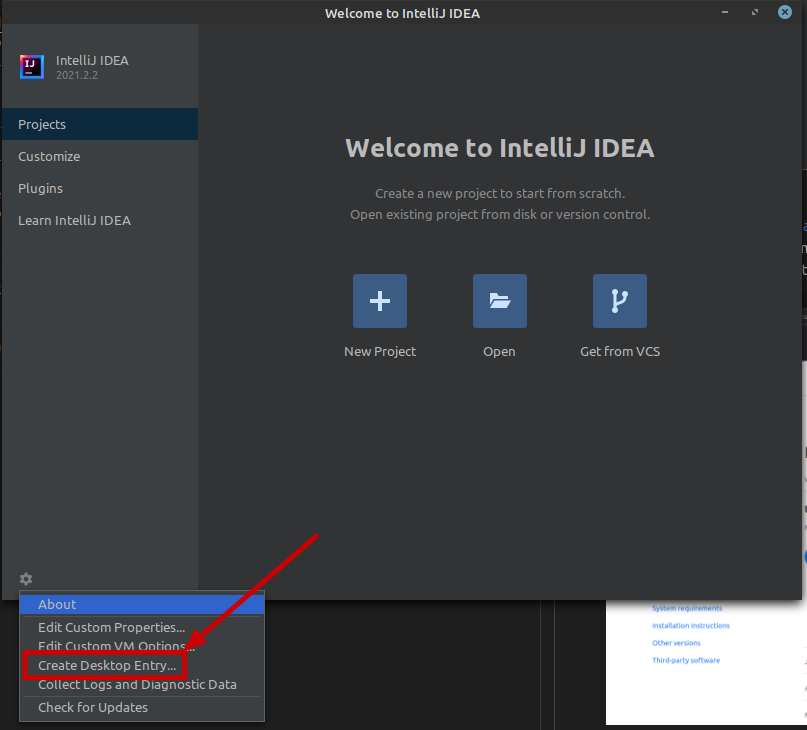
