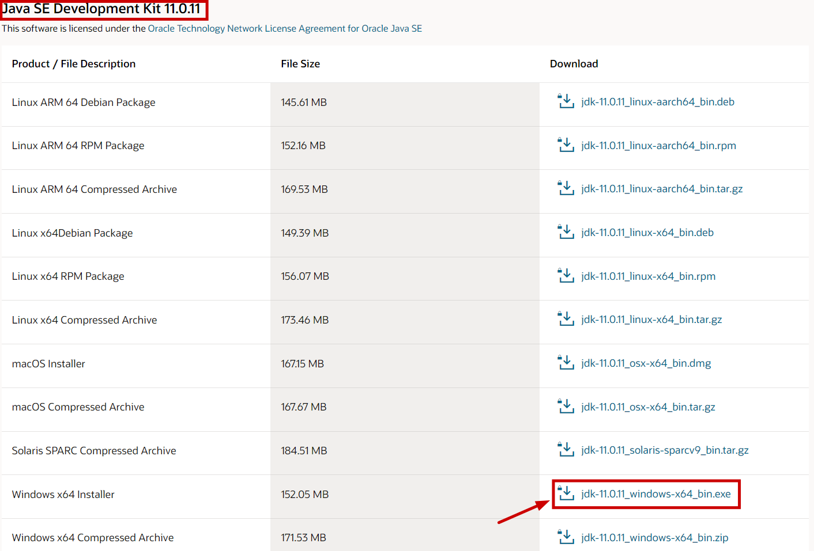
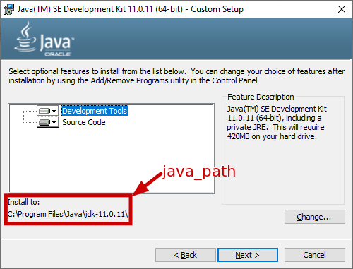
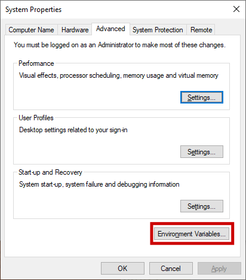
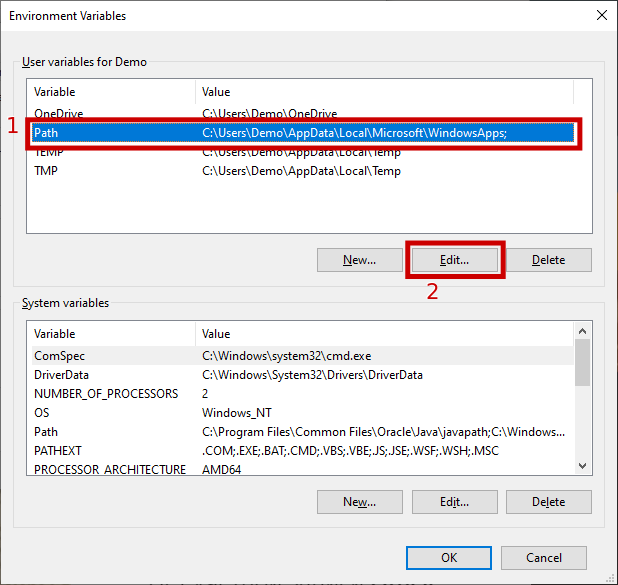
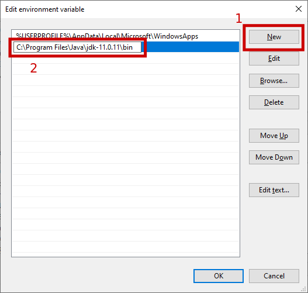
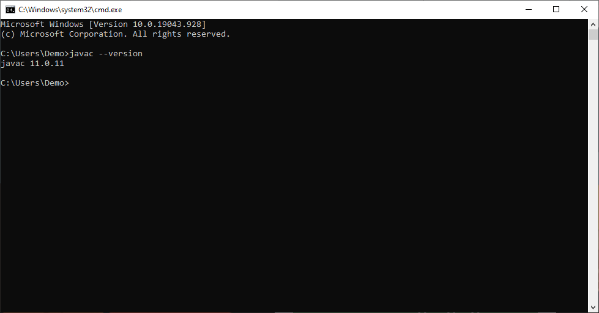
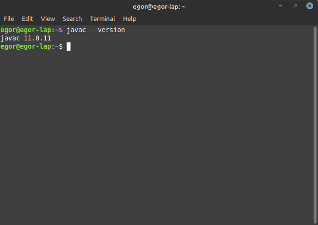

# Task 1
In this task we were supposed to program an artificial environment. There are 3 types of inhabitants in this environment:
- Wolves;
- Rabbits;
- Plants

Naturally, wolves eat rabbits, rabbits eat plants, plants grow randomly. Animals can move and spend energy for movements.

By the time this commit was made, we stopped on the moment, where we created basic classes for wolves, rabbits, plants and a field (it represents an environment they all live in). The task is to demonstrate thee code working.

***Below is the guide on how to achieve that, starting from the very beginning***

# How to setup Java and run project from 1st lesson
## Contents
If you already have some of these installed/set-up, you can skip those and jump straight into action.
1. [Install Java](#install-java)
    1. [Windows](#java-for-windows)
    2. [Linux](#java-for-linux)
2. Install IDE
3. Get code
4. Run project

## Install Java
First of all you need a Java JDK (stands for Java Development Kit). It includes Java compiler, standard library and JRE (Java Runtime Environment). In short, JDK is a kit for development on Java, JRE is the runtime environment, where Java program is executed.

Personally I'd recommend using JDK version 11. It's a widely supported version. Actually the latest version is 17th, but 11th is the one, 99% of all apps will support. Personally I keep to this version and have no problems with it. Thos whole guide will be for Java 11.

### Java for Windows
1. Go to the [official website download page](https://www.oracle.com/java/technologies/javase/jdk11-archive-downloads.html) and download version 11.0.11 as `.exe` for Windows 10 x64 (Refer to the screenshot below).

2. Accept agreement.

3. Log into your Oracle account or create one, if you don't have it yet.
4. Once you log in, your download should start.
5. Once the download is over, head to the folder you saved the installer to and run it.
6. After running the installer, remember or write down the path where Java will be installed. It will be later reffered to as `java_path`. Other options may be left with default values.

7. Install Java and press `Close` after installation is over.
8. Press `Win + r`.
9. Type in `SystemPropertiesAdvanced` and hit `Enter`.
10. In this window select `Environment Variables...`.

11. In the `User variables for <username>` select `Path` and press `Edit`.

12. Press `New` and type in your `java_path`+`\bin` into the prompt (refer to the screenshot).

13. Hit `Ok` in all 3 windows to save your changes.
14. Press `Win + r` once again.
15. Type in `cmd` and hit `Enter`.
16. In the newly opened window type `javac --version`. If the output is similar to the screenshot below, you're all set up with Java.

### Java for Linux
When speaking about Linux, I'll suppose you're using Ubuntu or Ubuntu-based distribution, that has `apt` package manager. Otherwise, I guess, you're experienced enough to set-up Java without this guide.

Development life is much easier for Linux users. So, if you use Linux, your setup process is just 3 steps away:
1. Open terminal or terminal emulator.
2. Type in `sudo apt update` to update your packages list.
3. Type in `sudo apt install -y openjdk-11-jdk`.
4. Once the installation is over, in the same terminal type `javac --version`. If the output is similar to the screenshot below, you're all set up with Java.

