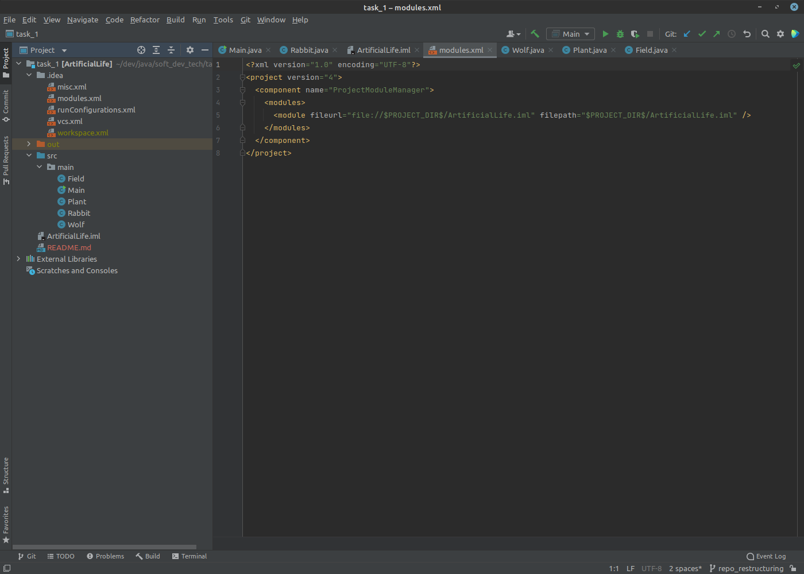
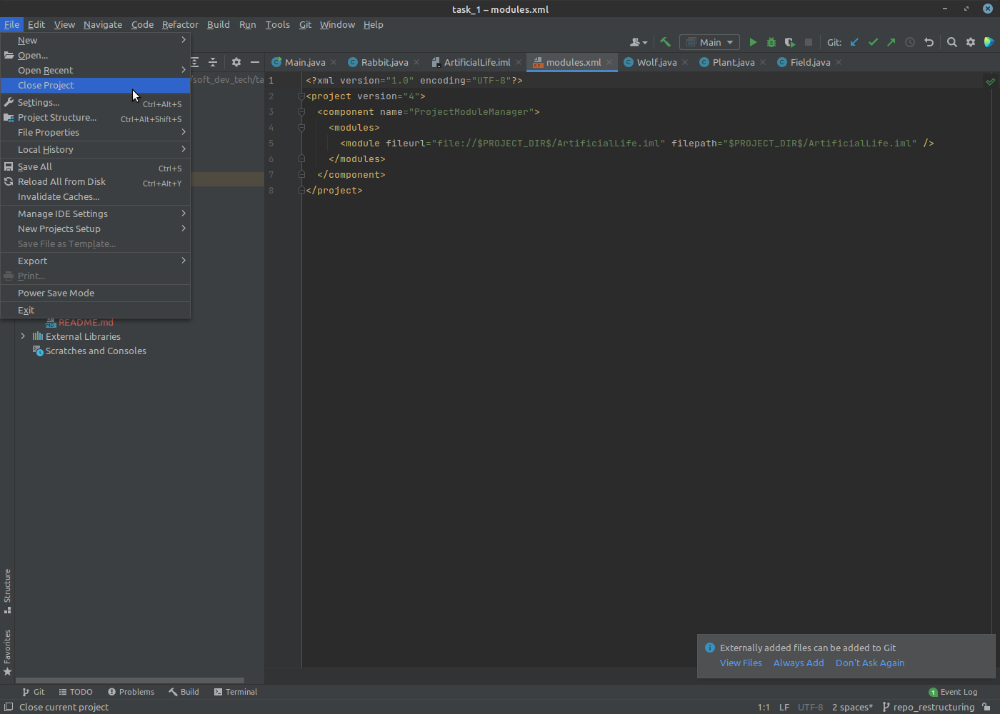
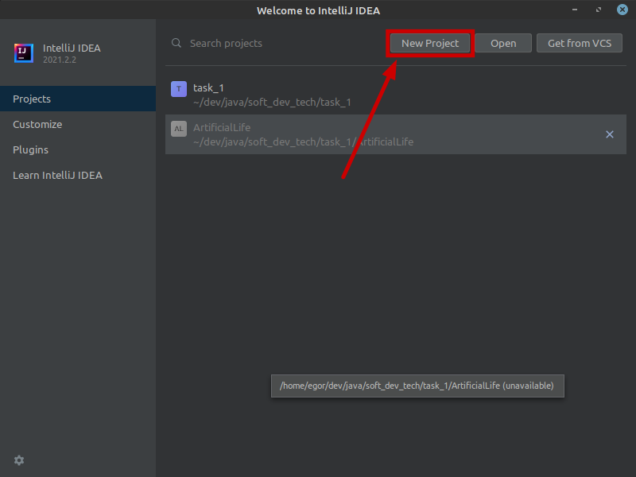
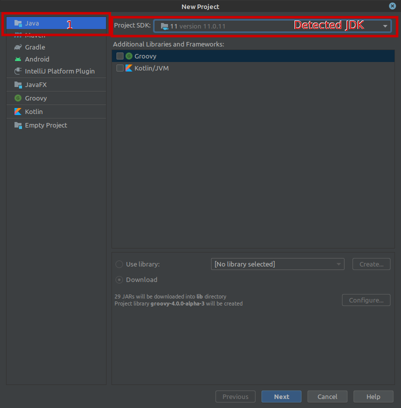
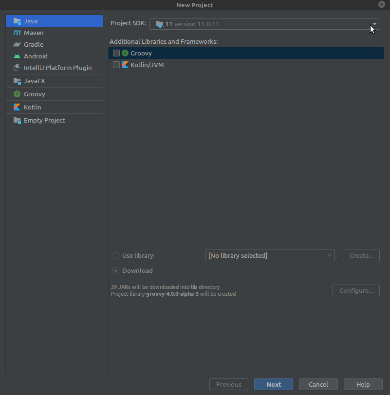
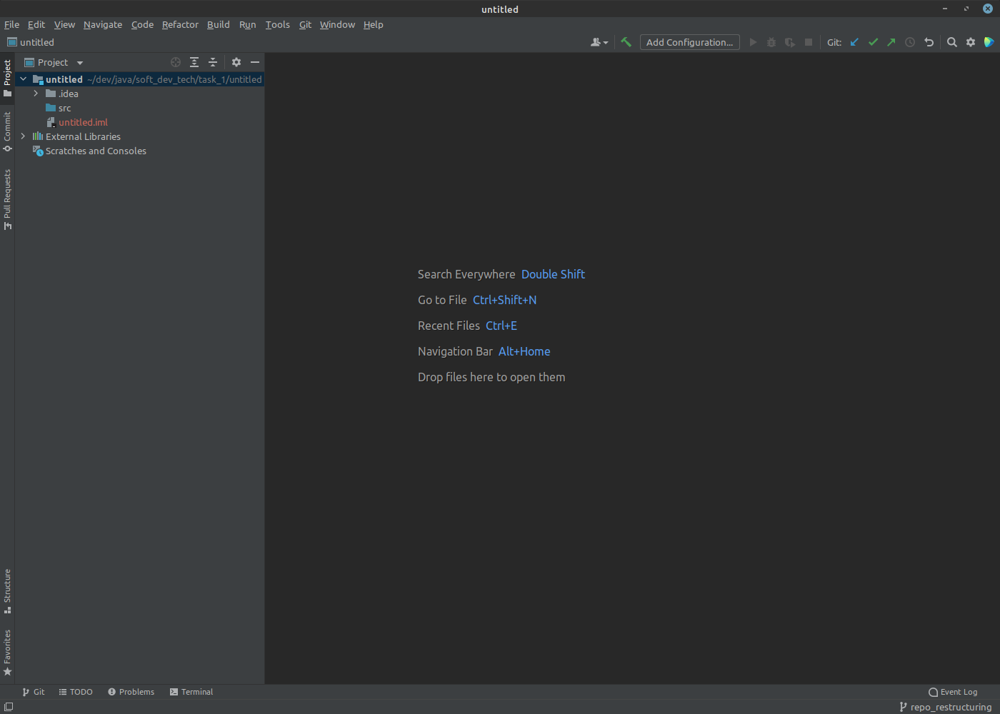
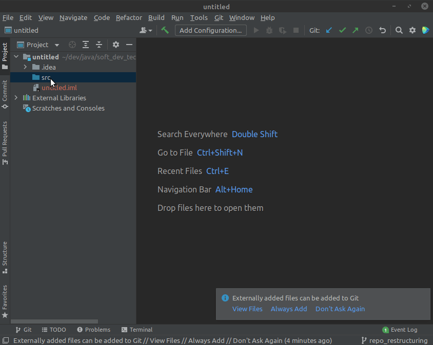
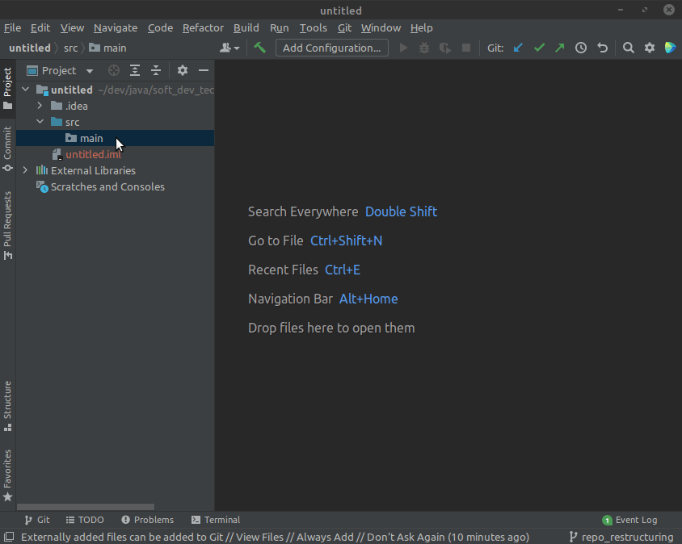
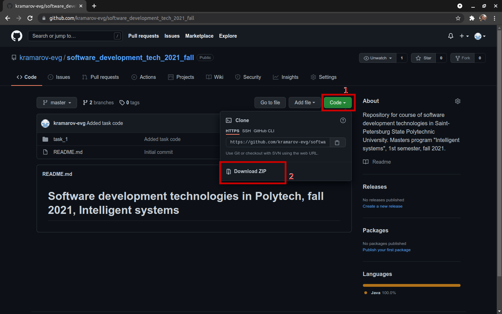
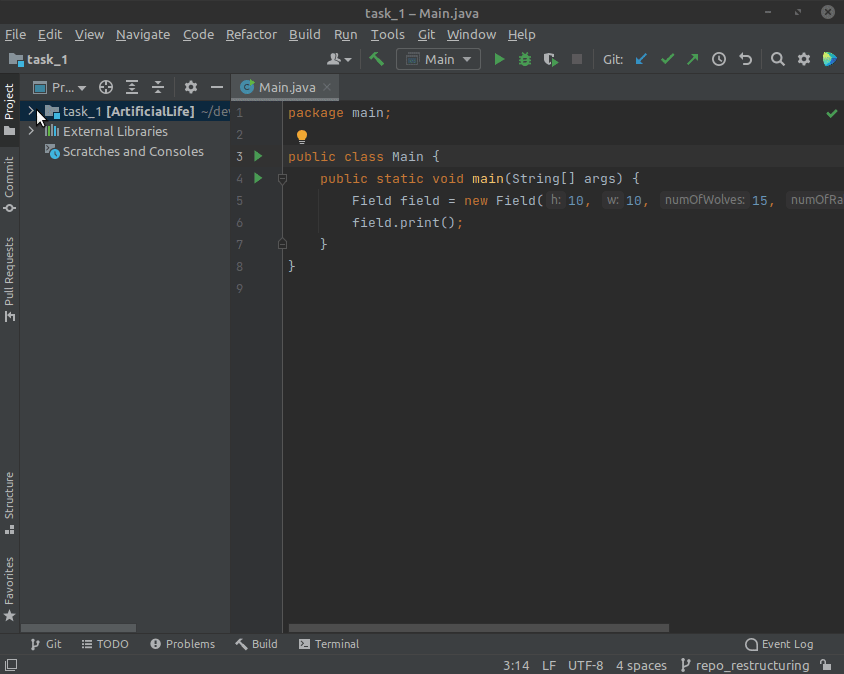

# Task 1
In this task we were supposed to program an artificial environment. There are 3 types of inhabitants in this environment:
- Wolves;
- Rabbits;
- Plants

Naturally, wolves eat rabbits, rabbits eat plants, plants grow randomly. Animals can move and spend energy for movements.

By the time this commit was made, we stopped on the moment, where we created basic classes for wolves, rabbits, plants and a field (it represents an environment they all live in). The task is to demonstrate the code compiling and running successfully.

***Below is the guide on how to achieve that.***

## To start with
It's supposed, that you have Java and InteeliJ IDEA IDE installed on your machine. If not, refer to the prerequisites section of this repository ([here](https://github.com/kramarov-evg/software_development_tech_2021_fall/tree/master/prerequisites))

## Contents
1. [Get the project](#getting-the-project)
    1. [By yourself](#creating-a-project)
    2. [From this repository](#downloading-project)
2. [Run the code](#running-the-code)

## Getting the project
There are 2 main options of how to get a working project:
- Create an IDEA project by yourself;
- Get it from this repository;

Personally I recommend the first way, as you should know, how to do this later. The second should be used only if you messed something up somehow, trying to create a project yourself.
### Creating a project
To create a project, follow these steps:
1. First open your IDEA.
2. **[Possible]** If you worked on some other project in IDEA before, your IDE may start with this project open, not the welcome screen (first screenshot below). To get back to the welcome screen, choose `File -> Close project` in the upper panel (second screenshot below).

3. Once you see IDEA's welcome screen, hit the `New project` button

4. In the left pane select `Java` for the project type, **NOT** `JavaFX`! In the `Project SDK` line should be your installed JDK detected (first screenshot below). If JDK is not detected automatically, specify a path to your JDK installation manually (second screenshot below). If none of these help, contact me, I'll try to figure out your issue.

5. After specifying JDK, Click `Next`. Leave `Create project from template` box unticked. Procced next.
6. On the next step specify a name for your project and choose, where it will be located. Once done, click `Finish`.
7. Once your project is created, you will see a window, simila to the one below:

8. In the left pane right-click the `src` folder and select `New -> package`. Then specify a name for a new package. I chose `main` for this tutorial. Packages are one of Java ways of controlling scopes of visibility. A bit similar to namespaces in C++. For more information on packages just google.

9. After adding the package, right-click that package in the left pane and select `New -> Java Class`. Give this class a name. Let's start with the `Plant` class. Once done, you'll see IDEA generated some boilerplate code for you. Neat feature.

10. Add classes `Wolf`, `Rabbit`, `Field` and `Main` the same way. They should all be located in the `main` package for now
11. Fill them with code from the corresponding classes from this repository ([from here](https://github.com/kramarov-evg/software_development_tech_2021_fall/tree/master/task_1/src)). After this procedure ALL `.class` files in repository and in your project should look **EXACTLY** the same.
12. When all code is in its place, you're done

### Downloading project
Another option to get the working project is to get it from this repository. I will not cover `git clone` option here, as Git is a bit too serious instrument to be explained here. Moreover, I guess, those of you who are familiar with Git won't need this guie at all.

So, to get the project from this repo, follow these steps:
1. Go to the GitHub repository root ([here](https://github.com/kramarov-evg/software_development_tech_2021_fall)).
2. Click `Code -> Download ZIP`. This will download the whole repository as a .zip archive.

3. Extract the archive and navigate to the freshly-extracted folder.
4. Locate folder `task_1` inside it.
5. Right-click it and select `Open with... -> IntelliJ IDEA`. It will open the folder as an idea project.
6. Once IDEA project opens, you're done

## Running the code

To run the code, in the left pane navigate to `src -> main -> Main.java`. In the left column of the code editor there should be 2 green triangles, similar to `Play` button symbols. Push the one, which is on the same line with the class definition. This will build the project and launch it.

